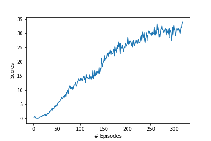

# Udacity Deep Reinforcement Learning Nanodegree 
## Project 2: Continuous Control Environment
 This is my implementation to sovle Continuous control Environment(Reacher) from Unity ML-Agents.

### Introduction

In this environment, a double-jointed arm can move to target locations. A reward of +0.1 is provided for each step that the agent's hand is in the goal location. Thus, the goal of the agent is to maintain its position at the target location for as many time steps as possible. The solution in this repository is currently only tested on single agent, in future the solution to multiple agent environment will be added. 

The observation space consists of 33 variables corresponding to position, rotation, velocity, and angular velocities of the arm. Each action is a vector with four numbers, corresponding to torque applicable to two joints. Every entry in the action vector should be a number between -1 and 1.

The task is episodic, and in order to solve the environment, the agent must get an average score of +30 over 100 consecutive episodes.

You can learn more about the environment from the official Project instructions from Udacity [here](https://github.com/udacity/deep-reinforcement-learning/tree/master/p2_continuous-control)

### Distributed Training

For this project, we will provide you with two separate versions of the Unity environment:
- The first version contains a single agent.
- The second version contains 20 identical agents, each with its own copy of the environment.  

The second version is useful for algorithms like [PPO](https://arxiv.org/pdf/1707.06347.pdf), [A3C](https://arxiv.org/pdf/1602.01783.pdf), and [D4PG](https://openreview.net/pdf?id=SyZipzbCb) that use multiple (non-interacting, parallel) copies of the same agent to distribute the task of gathering experience.  

### Solving the Environment

Note that your project submission need only solve one of the two versions of the environment. 

#### Option 1: Solve the First Version

The task is episodic, and in order to solve the environment,  your agent must get an average score of +30 over 100 consecutive episodes.

#### Option 2: Solve the Second Version

The barrier for solving the second version of the environment is slightly different, to take into account the presence of many agents.  In particular, your agents must get an average score of +30 (over 100 consecutive episodes, and over all agents).  Specifically,
- After each episode, we add up the rewards that each agent received (without discounting), to get a score for each agent.  This yields 20 (potentially different) scores.  We then take the average of these 20 scores. 
- This yields an **average score** for each episode (where the average is over all 20 agents).

The environment is considered solved, when the average (over 100 episodes) of those average scores is at least +30. 

### Setup Instructions:
#### 1. Requirements

To reproduce the results from this repository, it is suggested to use virtual python environment and python version 3.6. Python 3.7 at the point of creating this repository does not support tensorflow=1.7 which is a dependency of unityagents package. Follow these simple steps to setup the dependencies:

```shell
git clone https://github.com/Jerome-Michael/Continuous_Control.git

cd Continuous_Control (cloned Repository root)

python3 -m venv env_name

source env_name/bin/activate #for linux or

env_name\Scripts\activate.bat #for Windows.

pip install -r requirements.txt - local machine

!pip -q install ./python - to run on udacity workspace 

 ```

Next you need to download the unity environment of Reacher agent. Download the unity environment according to the OS you're using.

1. Download the environment from one of the links below.  You need only select the environment that matches your operating system:

    - **_Version 1: One (1) Agent_**
        - Linux: [click here](https://s3-us-west-1.amazonaws.com/udacity-drlnd/P2/Reacher/one_agent/Reacher_Linux.zip)
        - Mac OSX: [click here](https://s3-us-west-1.amazonaws.com/udacity-drlnd/P2/Reacher/one_agent/Reacher.app.zip)
        - Windows (32-bit): [click here](https://s3-us-west-1.amazonaws.com/udacity-drlnd/P2/Reacher/one_agent/Reacher_Windows_x86.zip)
        - Windows (64-bit): [click here](https://s3-us-west-1.amazonaws.com/udacity-drlnd/P2/Reacher/one_agent/Reacher_Windows_x86_64.zip)

    - **_Version 2: Twenty (20) Agents_**
        - Linux: [click here](https://s3-us-west-1.amazonaws.com/udacity-drlnd/P2/Reacher/Reacher_Linux.zip)
        - Mac OSX: [click here](https://s3-us-west-1.amazonaws.com/udacity-drlnd/P2/Reacher/Reacher.app.zip)
        - Windows (32-bit): [click here](https://s3-us-west-1.amazonaws.com/udacity-drlnd/P2/Reacher/Reacher_Windows_x86.zip)
        - Windows (64-bit): [click here](https://s3-us-west-1.amazonaws.com/udacity-drlnd/P2/Reacher/Reacher_Windows_x86_64.zip)

2. Place the file in this folder, unzip (or decompress) the file and then write the correct path in the argument for creating the environment under the notebook `Continuous_Control.ipynb`:

```python
env = env = UnityEnvironment(file_name="Reacher_Linux_NoVis/Reacher.x86")

```    
    
You are now ready to open the jupyter notebook for training and testing the Reacher agent!

#### 2. Train and Test your own Agent:

Instructions for training your own agent is shown in below notebook.

``` jupyter notebook Continuous_Control.ipynb  ```

### Results

The environment agent in this training was solved in 218 episodes! The algorithm used for training was DDPG. The results were achieved after a careful hyperparameter tuning, leading to a significant improvement. To read more about the algorithm, network architecture and hyper-Parameters settings read the [Report](./Report.pdf)

The training plot of the agent showing the scores improvement over the epsiodes is shown below.


The trained agent from my training is shown below.


